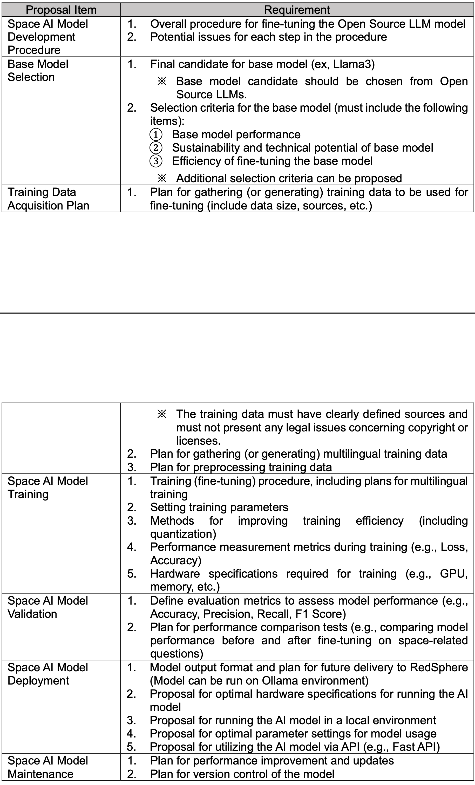
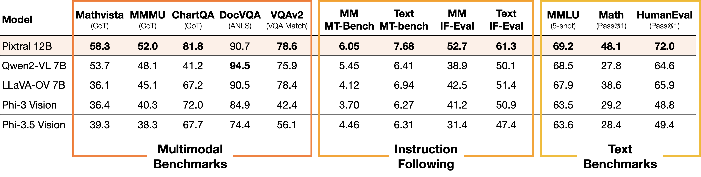

# SPACE AI Model

## Objectives

1. Develop a space AI model that understands space terminology and generates responses based on the latest space-related information.
2. Support multiple languages, particularly Korean, in the space AI model.
3. Fine-tune the space AI model using open-source base models for local installation and operation to reduce development costs.

## Proposal Items

  
<!--    -->

<!--  -->

## Proposal Development

### Space AI Model Development Procedure (Overall Fine-Tuning)

The goal is to briefly describe the process of creating the Space AI model.

- [ ] Find relevant articles to use as examples. This section can be covered with literature.

Relevant sources:

- GitHub repository for fine-tuning: [Unified Efficient Fine-Tuning of 100+ LLMs](https://github.com/hiyouga/LLaMA-Factory)

To do:
- [ ] **Discuss fine-tuning methods:**

| Tuning Method | Information | Comments |
|---------------|-------------|----------|
| Prompt Engineering and Few-Shot Learning | Easy to implement, but poor performance on specialized tasks. If the base model is powerful enough, it can be used for an MVP. | |
| Prompt Tuning | Train only prompt embeddings. Add to the input. | |
| Freeze-tuning | Freeze some parts of the model (usually lower layers) while tuning only specific layers or parameters. | |
| Adapters | Add additional modules to each layer and train them while keeping the original layers fixed. | |
| LoRA | A method to reduce the number of parameters being tuned, making training more efficient. | |
| QLoRA | LoRA + quantization. | |
| Knowledge Distillation | E.g., Student/Teacher model approach. Train the student on the teacher's response. | |

### Potential Issues for Each Step in the Procedure

- [ ] Discuss in the meeting.

### Monolingual and Multilingual Training

To-do:
- [ ] Find ways to handle the multilingual (Korean) requirement.

Possible actions:
- Add a translator to the input.
- Train the model on Korean data.
- Use sequential fine-tuning or extend the tokenizer to include Korean tokens.

### Domain Adaptation

- Emphasize space-related content during training to specialize the model.

## Base Model Selection

### Model Selection Criteria

Criteria for selecting the base model:
- Multilingual Support
- Multimodal Support (e.g., image-to-text, document QA)
- Benchmark performance
- Domain Knowledge
- Computational Resources (Assess hardware needs for training and inference)
- [ ] Discuss further

### Possible Candidates

| Name   | Arxiv | Properties | Model files (Hugging Face) | Information |
|--------|-------|------------|----------------------------|-------------|
| ARIA   | [2410.05993](https://arxiv.org/abs/2410.05993) | Multimodal open-source | - | An Open Multimodal Native Mixture-of-Experts Model |
| LLama 2 | [2307.09288](https://arxiv.org/abs/2307.09288) | Multimodal? | - | Not Apache 2.0 |
| Qwen   | [2309.16609](https://arxiv.org/abs/2309.16609) | Only 2VL model is multimodal | No big model is available (7b) | - |
| Pixtral | [2410.07073](https://arxiv.org/abs/2410.07073) | 12B | - | - |
| ... | ... | ...| ...| ...|

### Model Performance Benchmarks

- Reference benchmarks used in the Pixtral article:
  
- LLM performance list: [Chatbot Arena](https://huggingface.co/models?pipeline_tag=text-generation&sort=trending)
- LLM evaluation GitHub repo: [LLMTest_NeedleInAHaystack](https://github.com/gkamradt/LLMTest_NeedleInAHaystack/tree/main)

## Training Data Acquisition Plan

- Use academic journals, space agency publications (e.g., NASA, ESA, KARI), Wikipedia, and news articles.
- Reference: [Resources for Fine-Tuning LLMs with Space-Related Data](/r62hcXfZS8eK6yULtEYQyw)
- Datasets:
    - Physics Question Answering
    - ArXiv Dataset
    - Astronomical Dataset
    - US/UA Patents Data (for technical drawings)

Possible issues to discuss:
- [ ] What type of data are we planning to work with (e.g., can we focus only on text data)?
- [ ] What type of problems should the fine-tuned model solve?

## Space AI Model Training

<!-- Primarily based on [Unified Efficient Fine-Tuning of 100+ LLMs](https://github.com/hiyouga/LLaMA-Factory). -->
<!-- The necessity of this chapter could be revisited as the Space AI Model Development Procedure covers similar questions. -->

- [ ] To discuss

### Training Procedure

- [ ] To discuss

Training methods supported by [Unified Efficient Fine-Tuning of 100+ LLMs](https://github.com/hiyouga/LLaMA-Factory):

| Training Method                              | Description                                                                                           |
|----------------------------------------------|-------------------------------------------------------------------------------------------------------|
| Pre-Training                                 | Initial phase where the model is trained on a large corpus of data, often unsupervised, to learn general representations. |
| Supervised Fine-Tuning                       | Further training of the pre-trained model on a specific task using labeled data.                      |
| Reward Modeling                              | Training a model to optimize specific behaviors or outcomes based on rewards.                         |
| PPO (Proximal Policy Optimization) Training  | A reinforcement learning algorithm used for optimizing policies.                                      |
| DPO (Direct Policy Optimization) Training    | Focuses on direct optimization of policies to achieve the highest reward.                             |
| KTO (Knowledge Transfer Optimization) Training | Techniques for transferring knowledge from a teacher model to a student model.                        |
| ORPO (Optimized Reinforcement Policy Optimization) Training | Refines the policy optimization process for efficiency.                                 |
| SimPO (Simulation Policy Optimization) Training | Optimizes policies within a simulated environment.                                                   |

### Setting Training Parameters

| Name | Description |
|------|-------------|
| Learning Rate | - |
| Batch Size | - |
| Epochs Count | - |
| Weight Decay | - |
| Dropout Rate | - |
| ??? | - |

#### Hyperparameter Tuning

- [ ] To discuss

### Methods for Improving Training Efficiency

| Method Name | Description | Information |
|-------------|-------------|-------------|
| Mixed Precision Training | - | - |
| Gradient Accumulation | - | - |
| Distributed Training | - | - |
| Gradient Checkpointing | - | - |
| Pruning and Quantization | - | - |
| Knowledge Distillation | - | - |
| Hyperparameter Optimization | - | - |

### Performance Measurement Metrics During Training

- After selecting the base model, main loss metrics can be adopted.

### Hardware Specifications Required for Training

- [ ] To discuss

Questions to address:
- Are we planning to use our own GPUs? (Do we have them?)
- We can use base model specifications as a reference.

## Space AI Model Validation

### Define Evaluation Metrics to Assess Model Performance

This section can be divided into two groups: overall model performance and domain performance.

- SOTA benchmarks
- LLM comparison articles

### Domain Knowledge Validation

Questions:
- [ ] To discuss
- [ ] How can we evaluate the model's space-related knowledge?

## Space AI Model Deployment

> Need to investigate

### Proposal for Optimal Hardware Specifications for Running the AI Model

> Need to investigate

### Proposal for Running the AI Model in a Local Environment

> Need to investigate

### Proposal for Optimal Parameter Settings for Model Usage

> Need to investigate

### Proposal for Utilizing the AI Model via API (e.g., Fast API)

> Need to investigate

## Space AI Model Maintenance

> Need to investigate

### Plan for Performance Improvement and Updates

> Need to investigate

### Plan for Version Control of the Model

> Need to investigate
